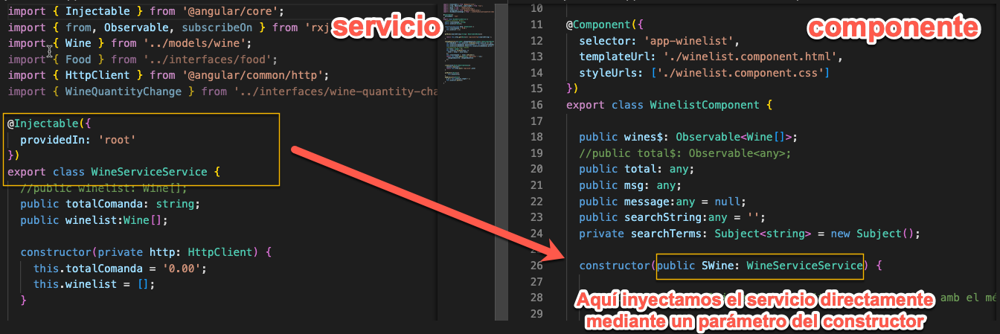
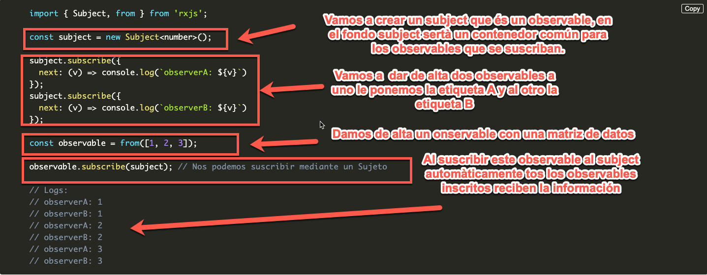
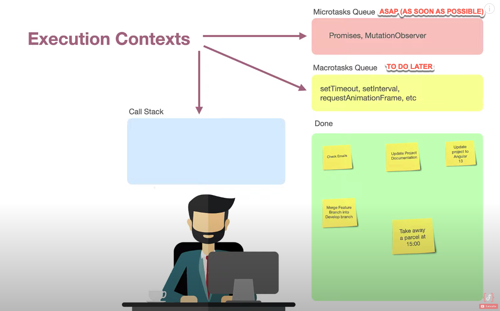
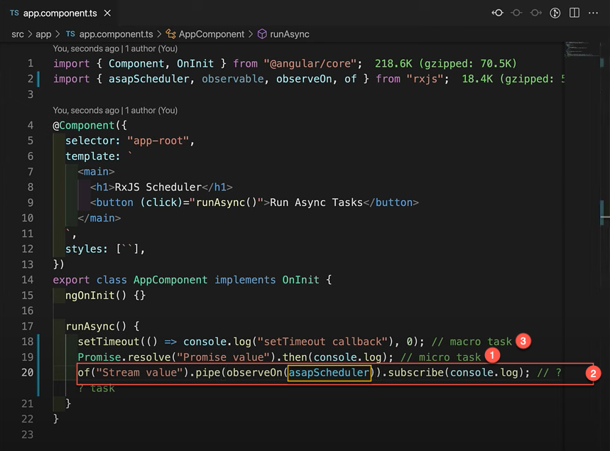
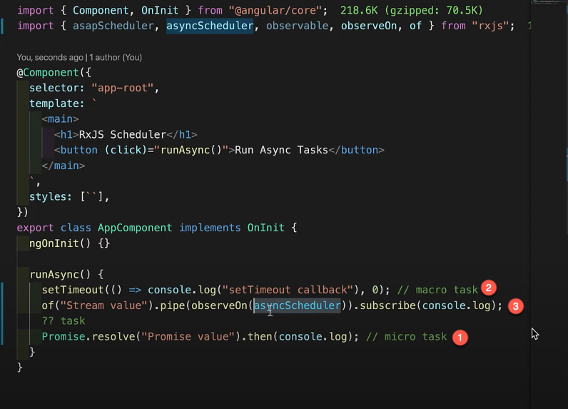
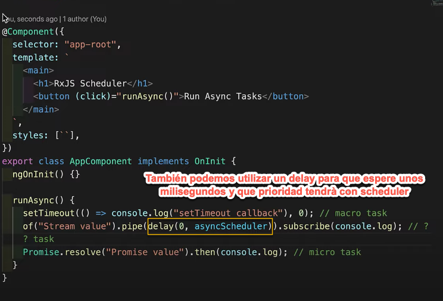

# ¿Cuál es la función de los componentes y servicios? (i.e. cuándo se debe utilizar cada uno de ellos)
* Los componentes son partes de nuestra aplicación, donde existe la parte visual (html, CSS) y la parte lógica (TS)
* Los servicios se encargan de dar la información necesaria que necesitan los componentes, por ejemplo la información de un producto, de un listado, etc.
# ¿Qué es la <<inyección de dependencias>>? ¿Para qué sirve el decorador @Injectable?
* La inyección de dependencias sirve para que cualquier clase o función pueda ser utilizada en cualquier parte, dígase componente y que se le inyecten las dependencias necesarias, de esta manera la funcion o clase no se ha de modificar para cada caso, por ejemplo los servicios, los podemos utilizar desde cualquier componente y el servicio no lo tendremos que modificar nunca.
* @injectable es un decorador que nos indica que la clase que decora será del tipo "inyección de dependencias", esto significa que puede necesitar dependencias que puedan ser entregadas por inyección de dependencias.

# Explica los siguientes conceptos de la programación reactiva que se usan en RxJS:

## Observable.
* Observable nos permite crear un objeto asíncrono con ciertos valores.

## Subscription
* Por defecto los observables no se activan para evitar ciclos de CPU innecesarios, para empezar a activar un observable tenemos que suscribirnos, al hacerlo nos permite activar ese observable.

## Operators
* Los operadores serían como funciones que tenemos disponibles para manipular mediante tuberías (**pipes**) los diferentes datos que va recibiendo los observadores.

## Subject
* Subject nos permite inyectar valores a varios observables a la vez, veamos el siguiente ejemplo:

## Schedulers
Schedulers nos permite establer que tipo de prioridad tiene cada uno de los observables, ya que al ser asíncronos no podemos decidir como aparecerén, entonces entra en juego los **scheduers**
Tenemos diferentes tipos de tareas:
* **ASAP (Microtasks)**: -> Parámetro: **asapScheduler** As soon as possible -> Tan pronto como sea posible, **tienen más prioridad**
* **To do later (Macrotask)**: -> Parámetro **asyncScheluder** Lo haré más tarde, **tienen menos prioridad**.

### Ejemplo ASAP (As soon as possible)

### Ejemplo ASYNC (To do later)

Se puede utilizar también un **delay**

créditos: https://www.youtube.com/watch?v=-OhAR6l-Q0Q

# ¿Cuál es la diferencia entre promesas y observables?
* Las promesas sólo pueden crear un hilo asíncrono con una única respuesta, mientras que los observables podemos tener varios hilos asíncronos.

# ¿Cuál es la función de la tubería (pipe) async?
* la función pipe nos permite interactuar con los diferentes valores de una observable.