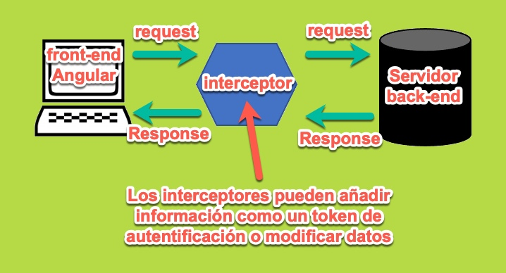
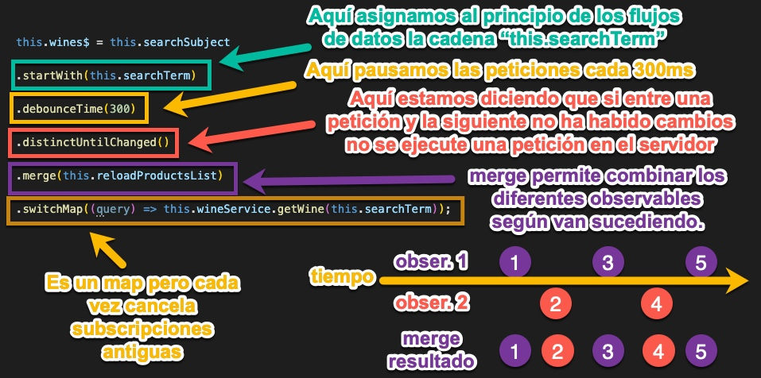

# ¿Qué son los interceptores?
* Los interceptables son herramientas que pueden inspeccionar y modificar los datos de las peticiones http, desde front-end a back-end y viceversa.

# Analiza la siguiente cadena de operadores de RxJS, explica cada uno de los pasos que se están desarrollando y explica en qué caso usarías este código:

